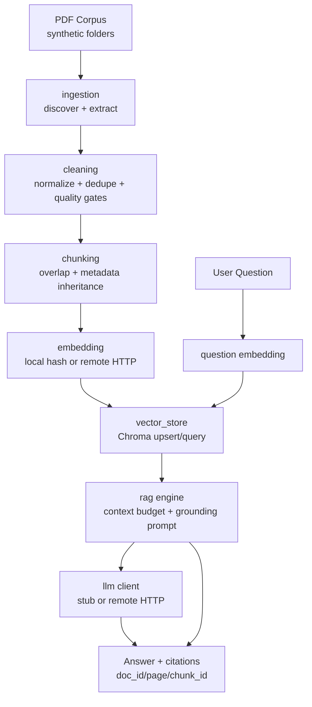

# Architecture Overview

This document describes the implemented prototype architecture from PDF ingestion
to citation-backed answers.

## End-to-end data flow

## Package responsibilities

- `real_estate_rag.ingestion`: recursive PDF discovery, stable `doc_id`, page-level extraction, scan-suspected warnings.
- `real_estate_rag.cleaning`: repeated header/footer reduction, conservative normalization, dedupe, `CleanSegment`.
- `real_estate_rag.chunking`: deterministic overlap chunking and stable `chunk_id`.
- `real_estate_rag.embedding`: embedding adapter interface (`local`, `remote_http`).
- `real_estate_rag.vector_store`: `VectorStore` abstraction + persistent `ChromaVectorStore`.
- `real_estate_rag.rag`: retrieval-to-generation orchestration, safe no-evidence behavior, citation contract.
- `real_estate_rag.cli`: demo/operator commands (`create-sample-data`, `ingest`, `index`, `ask`).

## Implemented runtime contracts

### Ingestion output

- Per-document: `doc_id`, `file_path`, `relative_path`, `file_name`, `silo`, `total_pages`, `warnings`
- Per-page: `page_index`, `text`, `char_count`, `scan_suspected`, `warnings`

### Cleaning output

- `CleanSegment`: `text`, `doc_id`, `page_span`, `silo`, `content_type`, `normalized_fields`, `warnings`

### Chunking output

- `TextChunk`: `chunk_id`, `text`, `doc_id`, `page_span`, `silo`, `content_type`, `normalized_fields`, `source_warnings`

### RAG output

- `RagResponse`: `answer_text`, `citations`, `insufficient_evidence`, `raw_retrieved_chunks`
- `Citation`: `chunk_id`, `doc_id`, `page_span`, `score`

## Decision log (trade-offs and choices)

1. **Vector store backend**
   - Alternatives: Qdrant, Pinecone, pgvector, Vertex AI Vector Search
   - Chosen for prototype: local persistent Chroma
   - Why: low setup overhead, real persistence, metadata filtering for demo reliability

2. **Chunking method**
   - Alternatives: tokenizer-based semantic chunking, recursive semantic splitters
   - Chosen: deterministic character-based chunks with overlap
   - Why: deterministic CI behavior and clear citation boundaries in a small prototype

3. **Embedding path**
   - Alternatives: managed API-only embeddings, local sentence-transformers
   - Chosen: adapter with local deterministic hash default + optional remote HTTP
   - Why: offline testability without secrets, with migration path to managed embeddings

4. **Retrieval strategy**
   - Alternatives: dense-only, hybrid BM25+dense, reranking
   - Chosen now: dense-only with metadata filtering
   - Why: smallest robust baseline; hybrid/reranking deferred to later iteration

5. **Grounding strategy**
   - Alternatives: free-form answer without citation contract
   - Chosen: strict context prompt + structured citation output + no-evidence refusal
   - Why: improves auditability and reduces unsupported valuation claims

## Why not default loaders + chunk-only RAG

For this PDF-heavy problem, default loading/chunking often preserves repetitive
headers, page markers, and inconsistent formatting (`$ 1,250,000`,
`3/7/2025`, `12500 SF`). The custom cleaning stage removes noise and normalizes
low-risk patterns before chunking, which improves downstream retrieval signal.

## Demo command mapping (implemented)

- Build synthetic corpus: `re-rag create-sample-data --output-dir ./sample_data`
- Index corpus: `re-rag index --input-dir ./sample_data --vector-db-path ./vector_db --collection valuation_chunks --embedding-provider local --embedding-dimensions 12`
- Ask grounded question: `re-rag ask --question "What cap rate evidence exists?" --vector-db-path ./vector_db --collection valuation_chunks --embedding-provider local --embedding-dimensions 12 --llm-provider stub --top-k 3`

## Scope boundaries

- Implemented: ingestion, cleaning, chunking, embeddings, vector retrieval, grounded answer orchestration, CLI demo, CI checks.
- Deferred: production auth, streaming UX, hybrid retrieval/rerank, large-scale perf tuning.
